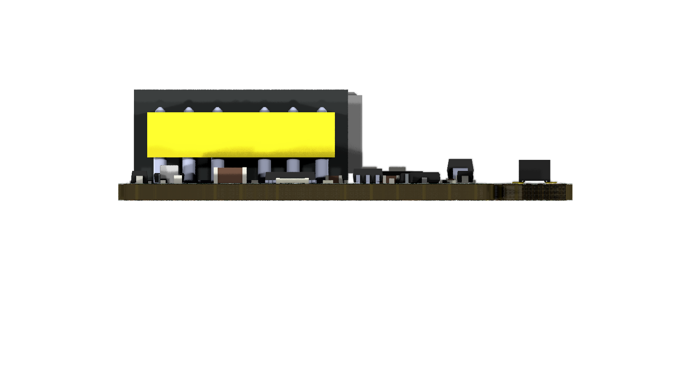

# Minimal_ADP1074

## Overview

This repository contains a minimal KiCad design project for the Analog Devices ADP1074, a current mode synchronous flyback controller with iCoupler-isolated feedback. The project includes schematic designs and PCB layout files for implementing this isolated power supply controller.

## Disclaimer

> [!NOTE]
> This project is provided "as is" and without any warranty, express or implied. For more details, please see the [LICENSE](LICENSE) file.

## About the ADP1074

The ADP1074 from Analog Devices is a current mode synchronous flyback controller with integrated iCoupler technology for isolated feedback. It is designed for high-efficiency, compact isolated DC-to-DC converters.

Key features include:

- **Integrated iCoupler Technology:** Provides isolated feedback without the need for an optocoupler, improving reliability and performance.
- **Current Mode Control:** Offers excellent line and load transient response.
- **Synchronous Rectification:** Improves efficiency by replacing the secondary-side diode with a MOSFET.
- **Programmable Frequency:** The switching frequency can be adjusted to optimize for size or efficiency.
- **Protection Features:** Includes overcurrent protection (OCP), overvoltage protection (OVP), and thermal shutdown.
- **Wide Input Voltage Range:** Supports a broad range of input voltages, making it suitable for various applications.
- **Package:** Available in a 24-lead LFCSP package.

## Project Structure

```
minimal_adp1074/
├── minimal_adp1074.kicad_pro       # Project configuration file
├── minimal_adp1074.kicad_sch       # Main schematic file
├── minimal_adp1074.kicad_pcb       # PCB layout file
├── fp-lib-table                    # Footprint library table
├── sym-lib-table                   # Symbol library table
├── docs/                           # Documentation files
│   ├── bom/                        # Bill of Materials
│   │   └── minimal_adp1074_ibom.html # Interactive BOM file
│   ├── pictures/                   # Images and photos
│   │   ├── 1_minimal_adp1074_side.png
│   │   ├── 2_minimal_adp1074_top.png
│   │   ├── 3_minimal_adp1074_bottom.png
│   │   ├── 4_minimal_adp1074_left.png
│   │   └── 5_minimal_adp1074_right.png
│   └── schematics/                 # Schematic PDF exports
│       └── minimal_adp1074_schematics.pdf
└── KiCAD_Symbols_Generator/        # Submodule for symbol generation from CSV data
```

## Project Features

This design provides a minimal implementation of the ADP1074 with:

- Proper power supply connections
- Isolated feedback using integrated iCoupler technology
- Synchronous rectification for high efficiency
- Standard footprint for the 24-pin LFCSP package

## Getting Started

### Prerequisites

- [KiCad EDA](https://www.kicad.org/) version 9.0 or later installed on your system
- Git (for cloning the repository and submodule management)

### Opening the Project

1. **Clone the repository** (including submodules):
   ```bash
   git clone --recursive https://github.com/ionutms/Minimal_ADP1074.git
   ```
   
   If you've already cloned the repository without submodules, initialize them with:
   ```bash
   git submodule init
   git submodule update
   ```

2. **Open the project in KiCad**:
   - Launch KiCad
   - Click "Open Existing Project"
   - Navigate to the cloned repository folder
   - Select the `minimal_adp1074.kicad_pro` file

3. **Explore the design**:
   - Open the schematic editor to view the circuit design
   - Open the PCB editor to view the board layout
   - Review the symbol and footprint libraries used in the design

### Project Files

- **Main schematic**: `minimal_adp1074.kicad_sch` - Contains the primary circuit design with the ADP1074 and support components
- **PCB layout**: `minimal_adp1074.kicad_pcb` - Physical board design file with proper component placement
- **Project configuration**: `minimal_adp1074.kicad_pro` - KiCad project settings

## Dependencies

This project has the following dependencies:

### 1. KiCAD Symbols Generator

This repository uses [KiCAD_Symbols_Generator](https://github.com/ionutms/KiCAD_Symbols_Generator) as a submodule for custom symbol generation.

To initialize the submodule after cloning this repository:

```bash
git submodule update --init --recursive
```

### 2. 3D Models

This project requires the [3D_Models_Vault](https://github.com/ionutms/3D_Models_Vault) repository for 3D models.

#### Setup for KiCAD 9:

1. Clone the 3D models repository:
   ```bash
   git clone https://github.com/ionutms/3D_Models_Vault.git
   ```

2. In KiCAD 9, add an environment variable:
   - Variable name: `KICAD9_3D_MODELS_VAULT`
   - Variable value: Full path to where you cloned the 3D_Models_Vault repository

## Usage

After setting up the dependencies, open the project in KiCad 9 to access all features including the 3D models.

## Symbol Generator Submodule

This project includes the KiCAD_Symbols_Generator as a submodule, which provides tools for generating KiCad symbols from CSV data files. For more information on using this tool, see the [KiCAD_Symbols_Generator documentation](minimal_adp1074/KiCAD_Symbols_Generator/README.md).

## Documentation

The `docs` folder contains:
- Schematic PDF exports
- Images and photos of the design

## Visuals

The following images showcase the PCB design from different perspectives:


*Top View of the PCB*


*Side View of the PCB*


*Bottom View of the PCB*


*Left View of the PCB*


*Right View of the PCB*

## License

This project is licensed under the MIT License - see the [LICENSE](LICENSE) file for details.

## References

- [ADP1074 Datasheet](https://www.analog.com/media/en/technical-documentation/data-sheets/ADP1074.pdf)
- [KiCad EDA](https://www.kicad.org/)